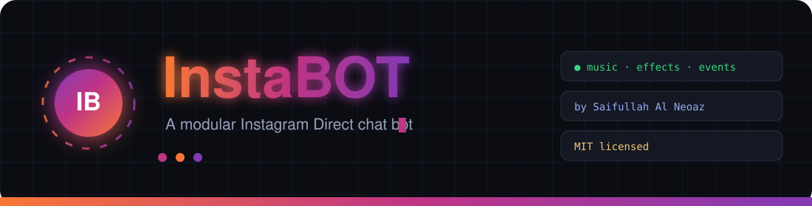

⚡ Saan Exhausted — Insta-Goat-Bot V3

A modern Instagram Direct chat bot platform built and customized by Siam Ahmed Saan.

High-throughput messaging • Media automation • Modular commands • AI tools • Games • Utilities

""License" (https://img.shields.io/badge/license-MIT-ff4d8d?style=for-the-badge)" (LICENSE)
""Node.js" (https://img.shields.io/badge/node-%3E%3D20-34d399?style=for-the-badge&logo=node.js)" (https://nodejs.org/)
""GitHub" (https://img.shields.io/badge/GitHub-Fineshyt--Saan-181717?style=for-the-badge&logo=github)" (https://github.com/Fineshyt-Saan)
""Repository" (https://img.shields.io/badge/Repository-Insta--Goat--Bot--V3-8b5cf6?style=for-the-badge)" (https://github.com/Fineshyt-Saan/Insta-Goat-Bot-V3)

  <a href="#-overview">Overview</a> •
  <a href="#-features">Features</a> •
  <a href="#-architecture">Architecture</a> •
  <a href="#-quick-start">Quick Start</a> •
  <a href="#-configuration">Configuration</a> •
  <a href="#-commands">Commands</a> •
  <a href="#-deployment">Deployment</a> •
  <a href="#-security">Security</a>

---

👑 Project Information

Field| Information
Project Name| Saan Exhausted — Insta-Goat-Bot V3
Developer| Siam Ahmed Saan
Brand| Saan Exhausted
GitHub| Fineshyt-Saan
Repository| Insta-Goat-Bot-V3
Instagram| siam_exists
Version| V3
Runtime| Node.js 20+
License| MIT

---

🌟 Overview

Saan Exhausted — Insta-Goat-Bot V3 is a modular Instagram Direct messaging bot designed for automation, interactive commands, media processing, AI integrations, games, utilities, and event-driven functionality.

The project is organized to make command development and bot customization easier while keeping the runtime suitable for local and cloud deployment.

What it provides

- ⚡ Instagram Direct messaging automation
- 🧩 Modular command architecture
- 🎮 Games and entertainment commands
- 🤖 AI-powered utilities
- 🎵 Music and media tools
- 🖼️ Image and video processing
- 👥 Group and user management
- 🔧 Custom event handlers
- 📊 Runtime and health monitoring
- ☁️ Cloud deployment support
- 🛠️ Developer-friendly command structure

---

✨ Features

💬 Messaging

- Direct message handling
- Group conversation support
- Reply-based interactions
- Reaction/event handling
- Automated responses

🧩 Command System

Commands are organized into independent modules so individual features can be added, removed, or modified without rebuilding the entire application.

🤖 AI Tools

The bot can be extended with AI-based commands and external API integrations.

🎵 Media

Support for media-oriented functionality such as:

- Music
- Video
- Images
- Effects
- Stickers
- Canvas-generated content

🎮 Games

The project can include multiple interactive games and economy-style commands.

🛡️ Administration

Administrative functionality can include:

- User management
- Permission checks
- Developer controls
- Command restrictions
- Group moderation

---

🏗️ Architecture

              Instagram
                  │
                  ▼
          ┌─────────────────┐
          │   Event Layer   │
          └────────┬────────┘
                   │
                   ▼
          ┌─────────────────┐
          │   Bot Runtime   │
          └────────┬────────┘
                   │
        ┌──────────┼──────────┐
        ▼          ▼          ▼
   Commands     Events      Replies
        │          │          │
        └──────────┼──────────┘
                   ▼
        ┌─────────────────────┐
        │ Media / AI / Utils  │
        └──────────┬──────────┘
                   ▼
              Response

Runtime layers

Transport Layer

Handles communication between the bot and Instagram.

Runtime Layer

Responsible for:

- Command routing
- Permission checking
- Event processing
- Reply handlers
- Runtime state

Command Layer

Contains the individual bot commands and plugins.

Service Layer

Provides media, AI, API, scheduling, and utility functionality.

Storage Layer

Handles configuration, sessions, persistent data, and runtime information.

---

🚀 Quick Start

1. Requirements

Before starting, make sure you have:

- Node.js 20 or newer
- npm
- Git
- A dedicated Instagram account for automation
- Valid authentication/session information

2. Clone the repository

git clone https://github.com/Fineshyt-Saan/Insta-Goat-Bot-V3.git
cd Insta-Goat-Bot-V3

3. Install dependencies

npm install

4. Configure the bot

Check the available configuration files in the repository.

Typical configuration files include:

config.json
account.txt
.env

Do not publish private session cookies, passwords, API keys, or tokens.

5. Start the bot

npm start

If the repository uses a direct Node entry point:

node index.js

---

⚙️ Configuration

A typical configuration can follow this structure:

{
  "botName": "Saan Exhausted",
  "prefix": "-",
  "language": "en",
  "devUsers": [
    "YOUR_INSTAGRAM_UID"
  ]
}

Developer UID

Replace:

YOUR_INSTAGRAM_UID

with the numeric UID of the Instagram account that should have developer-level access.

Example:

"devUsers": [
  "123456789012345"
]

Do not use a guessed UID.

---

🔐 Authentication

If the project uses exported Instagram session cookies, keep them private.

For example:

account.txt

should never be publicly exposed if it contains active authentication information.

Recommended practice

Public repository
      │
      ├── Source code
      ├── Commands
      ├── Documentation
      └── Configuration examples

Private
      │
      ├── Session cookies
      ├── Passwords
      ├── API tokens
      └── Private credentials

---

📁 Project Structure

Insta-Goat-Bot-V3/
│
├── assets/
│   └── branding and media assets
│
├── commands/
│   └── bot commands and plugins
│
├── events/
│   └── event handlers
│
├── languages/
│   └── language files
│
├── src/
│   └── runtime and application logic
│
├── test/
│   └── test and verification files
│
├── auth.js
│   └── authentication/connection logic
│
├── config.json
│   └── bot configuration
│
├── index.js
│   └── main application entry point
│
├── package.json
│   └── dependencies and scripts
│
├── Dockerfile
│   └── Docker deployment configuration
│
├── .gitignore
│   └── ignored/private files
│
├── LICENSE
│   └── project license
│
└── README.md
    └── project documentation

---

🧩 Commands

The bot uses a modular command system.

Commands can be grouped into categories such as:

⚙️ General

help
ping
uid
info
uptime

🎵 Media

music
sing
video

🤖 AI

ai
img
gemini
claude

🎮 Games

spin
slot
quiz
rps
coinflip
mines

👥 Group / Admin

admin
ban
adduser
removeuser
whitelist

«The exact available commands depend on the command files currently present in this repository.»

---

🛠️ Development

To create a new command, follow the command structure already used inside:

commands/

Keep each command modular and avoid placing unnecessary credentials directly inside command files.

Recommended command metadata

module.exports = {
  config: {
    name: "example",
    version: "1.0.0",
    author: "Siam Ahmed Saan",
    countDown: 5,
    role: 0,
    shortDescription: {
      en: "Example command"
    },
    category: "utility"
  },

  onStart: async function ({ message }) {
    return message.reply("Saan Exhausted");
  }
};

---

☁️ Deployment

Node.js

npm install
npm start

PM2

npm install -g pm2
pm2 start index.js --name "saan-exhausted"
pm2 save
pm2 startup

Docker

docker build -t saan-exhausted-instabot .
docker run -d \
  --name saan-exhausted-instabot \
  saan-exhausted-instabot

---

🧪 Testing

If a test script is available:

npm test

You can also verify that the application starts correctly with:

npm start

---

🔒 Security

Never commit:

account.txt
.env
session files
cookies
passwords
API keys
private tokens

Use ".gitignore" for private files.

Example

account.txt
.env
*.session
*.cookie
cookies.json
config.private.json

---

👨‍💻 Developer

Siam Ahmed Saan

Saan Exhausted

Developer • Bot Builder • Automation Enthusiast

GitHub: Fineshyt-Saan

Instagram: siam_exists

Repository: Insta-Goat-Bot-V3

---

🔗 Official Project

GitHub Repository

https://github.com/Fineshyt-Saan/Insta-Goat-Bot-V3

GitHub Profile

https://github.com/Fineshyt-Saan

---

📜 License

This project is distributed under the license included in the repository.

Please review "LICENSE" (LICENSE) before redistributing or modifying the project.

---

⚡ Saan Exhausted

Built and customized by Siam Ahmed Saan.

"Saan Exhausted • Insta-Goat-Bot V3"

